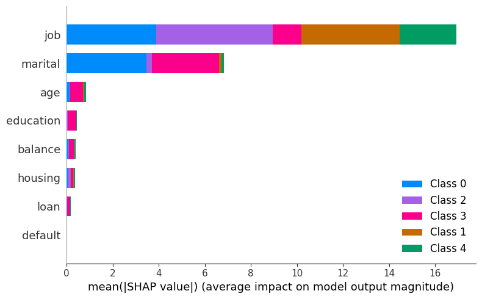
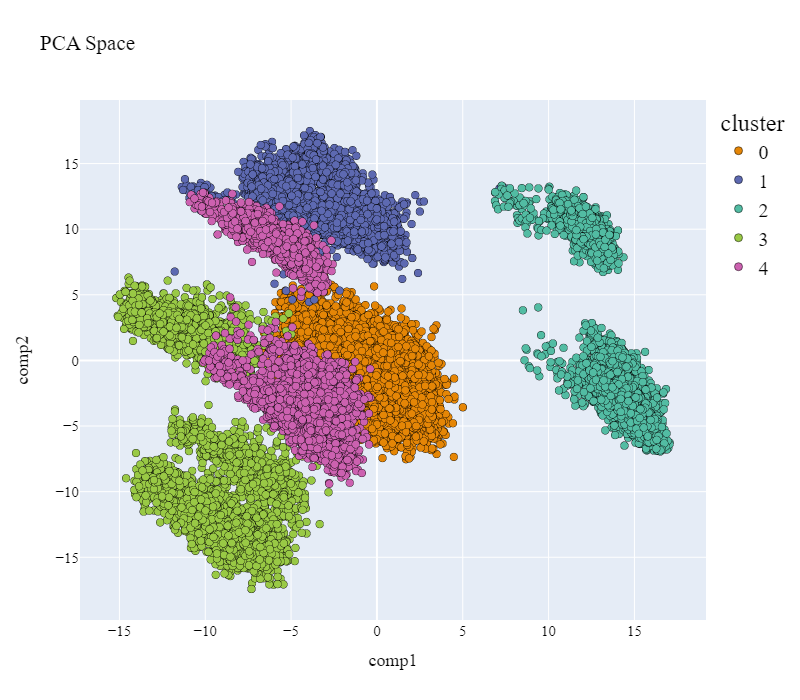
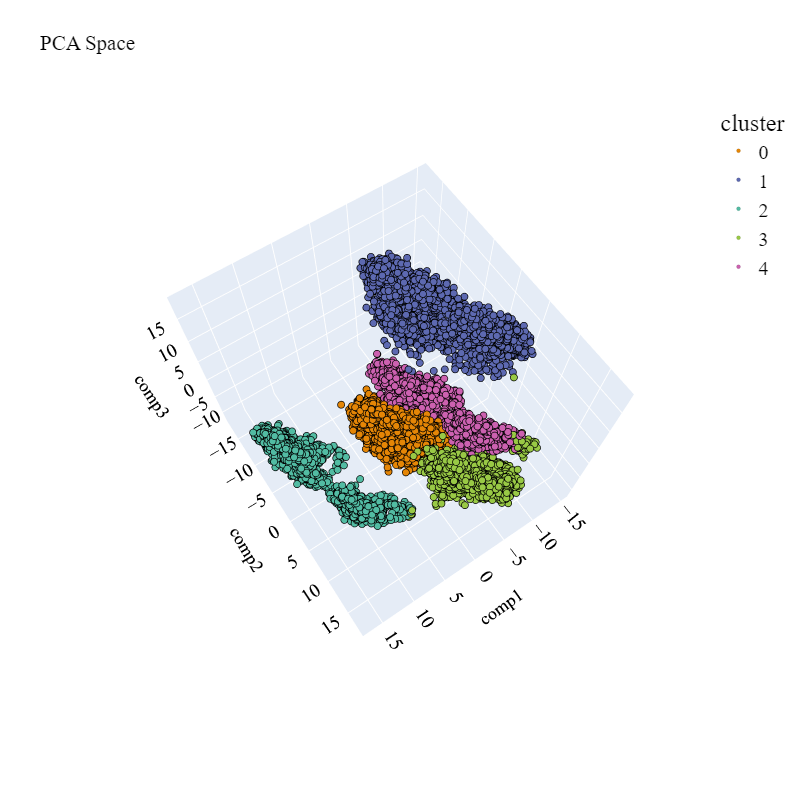
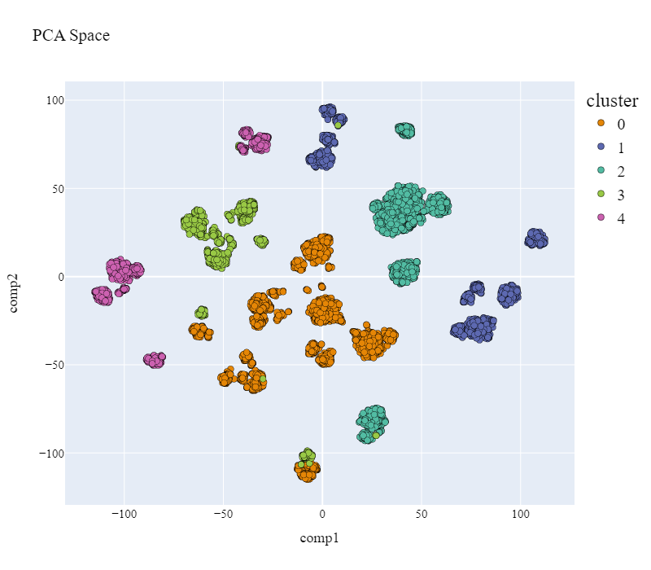

# Customer Segmentation Project(Part2)

This project explores customer segmentation using **LLM**.
Youtube video link : https://youtu.be/gktzut2LbwM

## Overview

I've employed advanced techniques, including the **K-means** algorithm. The plus here is the use of a **Large Language Model** (LLM) for segmentation 
that is more contextual and precise than ever. Discover how I also determined the optimal number of clusters using the elbow method. 
To ensure outstanding results, I selected the best clustering models using the **Silhouette Score**. And to top it all off, we will explore 
captivating visualization techniques, including **Principal Component Analysis** (PCA) and **t-SNE**. The results are not only informative but also visually stunning.🔍🎯

## Results

Some visualization of clusters through PCA(2D/3D): 

Some visualization of clusters through t-SNE(2D): 

## Video Demo

Youtube video link : https://youtu.be/gktzut2LbwM

## Contributing

GUIDJIME ADINSI Ahouahounko
Former Data scientist/Machine Learning Engineer at Abeille Assurances

